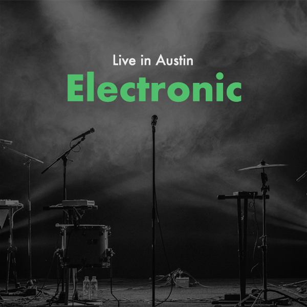

# Drivetone

Below are a bunch of spotify playlists for finding live music in Austin. The playlists are all created under the [Drivetone](https://open.spotify.com/user/31avngohywcdspvfigvakfnw53o4?si=fdb381eae8b04765) spotify user.

The first is a running playlist with artists playing this current week, updated every week. The rest are split by month and genre and are not updated once the month is over.

I made this for myself but enjoy!

## Playlists

### Live in Austin

#### Oct 2023

#### Nov 2023

#### Dec 2023

## Background

I wanted to see more live music so I thought it would be cool to find all the musicians playing in Austin and group them by month and genre and create playlists so I could find new artists and see them live.

Then covid happened and I didn't bother for about three years... Went to a couple concerts recently and had a great time so went back to this and finished up an MVP.

Anyway, thanks for visiting, hope you get to see some live music and discover new artists from these!
