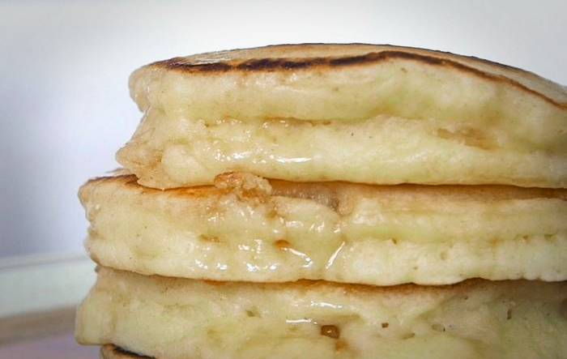

# Big Ol Fluffy Pancakes

- Total time: 35 minutes
    - Prep time: 20 minutes
    - Cook time: 15 minutes
- Yield: 4 servings
- Modified from: [Matty Matheson](https://www.youtube.com/watch?v=2iWUUcW08ac)

{:width="600px"}
 
_Image source: <https://vice.com>_

## Inventory

### Ingredients

#### Batter

- 1 T butter
- 1 cup all-purpose flour
- 1½ T granulated sugar
- ½ tsp baking powder
- ½ tsp baking soda
- ¼ tsp cinnamon
- Pinch of salt
- 2 eggs
- 1 cup buttermilk
- 1 tsp vanilla extract
- ½ T granulated sugar

#### Cooking

- Some butter
- Little oil

### Special Equipment

- 3 small bowls
- 1 medium bowl
- Small strainer/sifter
- Whisk
- Hand mixer
- Nonstick pan

## Instructions

### Prepare

1. In small bowl
    1. Melt **1 T butter**, let cool
1. In small bowl
    - Sift **1 cup all-purpose flour**
    - **1½ T granulated sugar**
    - **½ tsp baking powder**
    - **½ tsp baking soda**
    - **¼ tsp cinnamon**
    - **Pinch of salt**
1. In medium and small bowl, separate **2 eggs**
    1. Add egg whites to medium bowl
        1. Beat till fluffy
        1. Add **1 cup buttermilk**
        1. Add **1 tsp vanilla extract**
    1. Add egg yolks to small bowl
        1. Whisk to combine
        1. Add **½ T granulated sugar**
        1. Slowly add **1 T melted, cooled butter**
1. To egg white mixture in medium bowl
    1. Slowly add yolk mixture
    1. Slowly add flour mixture, mix until just combined
1. Refridgerate for 10 minutes

### Cook

1. Heat nonstick pan over medium-high heat
1. Add **some butter** and a **little oil** to the pan, let melt
1. Spoon batter into pan and let sit
1. After a bit, add some more butter and swirl around edges of pancakes
    - This adds a crispy edge
1. When you see bubbles in middle, flip
1. Remove and place in warm oven when you feel like it
1. Repeat as necessary, adding mixins like blueberries or chocolate chips if you want

## Notes

### Storage

- Just eat them immediately
