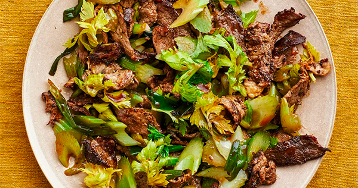

# Black Pepper Beef and Celery Stir-Fry

- Total time: 30 minutes
    - Prep time: 15 minutes
    - Cook time: 15 minutes
- Yield: 4 servings
- Author: [Andy Baraghani](https://www.bonappetit.com/recipe/black-pepper-beef-and-celery-stir-fry)

{:width="600px"}
 
_Image source: <https://bonappetit.com>_

## Inventory

### Ingredients

- 3 cloves **garlic**
- 1" piece **ginger**
- 1 lb **sirloin steak**
- 5 stalks **celery**
- 4 **scallions**
- 1 T **unsalted butter**
- 2 tsp **freshly ground black pepper**
- 1 tsp toasted **sesame oil**
- 2 T **neutral oil**, divided
- **Kosher salt**
- 2 T low-sodium **soy sauce**
- 1 T unseasoned **rice vinegar**
- 3 T **water**
- Cooked **rice** (for serving)

#### Substitutes

- Celery
    - Choppod bok choy
    - Cabbage

### Special Equipment

- Large cast-iron skillet

## Instructions

### Prepare

_Cook rice or sides before prepping._

- Finely grate **3 cloves garlic**, **1" piece ginger**
- Thinly slice crosswise **1 lb sirloin steak**
- Slice crosswise **5 stalks celery** into ¼" thick pieces
    - Keep around **1 cup celery leaves**
- Cut crosswise **4 scallions** into 1½"–2" pieces
- Cut **1 T unsalted butter** into 4-8 pieces

- In medium bowl
    1. Whisk
        - **3 cloves garlic, finely grated**
        - **1" piece ginger, finely grated**
        - **2 tsp freshly ground black pepper**
        - **1 tsp toasted sesame oil**
        - **1 T neutral oil**
    1. Toss to coat
        - **1 lb sirloin steak**
        - Season with **kosher salt**

### Cook

_One pot recipe, all in large cast-iron skillet._

1. Heat **1 T neutral oil**
1. 1 min - **1 lb sirloin steak**
1. 2 min - toss often, until scallions slightly charred
    1. Turn **steak** over
    1. Add **5 sliced stalks celery**
    1. Add **4 sliced scallions**
1. Remove from heat
1. Toss until butter is melted and sauce coats steak
    - **2 T low-sodium soy sauce**
    - **1 T unseasoned rice vinegar**
    - **1 T unsalted butter**
    - **3 T water**
1. Toss until slightly wilted
    - **1 cup celery leaves**

## Notes

### Serving

1. Divide **rice** among bowls and top with **beef stir-fry**.

### Storage

- Will keep in airtight container in refridgerator for like a few days probably
