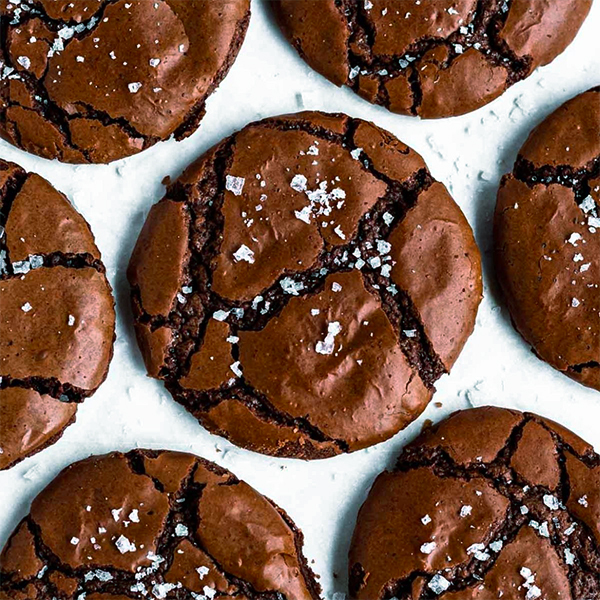

# Brownie Cookies

- Total time: 45 minutes
    - Prep time: 30 minutes
    - Chill time: 0 minutes
    - Cook time: 12 minutes
    - Post-cook time: 10 minutes
- Yield: 16 3-4" cookies
- Author: [Sarah Kieffer](https://www.thevanillabeanblog.com/100-cookies/)

{:width="600px"}
 
_Image source: <https://richanddelish.com>_

## Inventory

### Ingredients

- ¾ cup + 1 T (116g) **all-purpose flour**
- ¾ tsp **baking powder**
- 3 large **eggs**
- 1¼ cup (250g) **granulated sugar**
- ¾ tsp **kosher salt**
- 1 T **neutral oil**
- 1 tsp **vanilla extract**
- 5 T (70g) **unsalted butter**
- 8oz (226g) **semi-sweet chocolate**
- ¼ cup (25g) unsweetened **cocoa powder**

### Special Equipment

- Baking scale
- Medium bowl
- Large bowl
- Hand mixer / stand mixer w/ paddle
- Small saucepan
- Baking sheet
- Parchment paper

## Instructions

_Note: does not need to be refridgerated before baking_

### Prepare

1. Preheat oven to 350°F
1. In medium bowl
    1. Mix
        - **¾ cup + 1 T (116g) all-purpose flour**
        - **¾ tsp baking powder**
1. In large bowl _(meanwhile melt butter/chocolate, see below)_
    1. 6-8 min - beat on med-high till pale, 2x volume
        - **3 large eggs**
        - **1¼ cup (250g) granulated sugar**
        - **¾ tsp kosher salt**
    1. Beat on low
        - **1 T neutral oil**
        - **1 tsp vanilla extract**
1. In small saucepan
    1. Melt over low heat, stirring frequently
        - **5 T (70g) unsalted butter**
        - **8oz (226g) semi-sweet chocolate**
    1. Once melted, off heat, whisk in to butter/chocolate
        - **¼ cup (25g) unsweetened cocoa powder**
1. Mix **butter/chocolate** into **egg mixture** on low
1. Mix **flour/powder** in on low

### Rest

1. 5 min - let rest at room temp

### Pre-bake

1. Line baking sheet with parchment paper
1. Drop **heaping T of batter** (35g) at least 2" apart
    - Cookies will spread to 3-4" wide

### Bake

1. 8-12 min - bake at 350°F
    - Until puffed and cracked and edges are set
    - Rotate halfway through

### Post-bake

1. Optionally sprinkle **flaky salt** on **cookies**
1. 10 min - cool completely on pan

## Notes

### Storage

- Will keep in airtight container at room temperature for 2-3 days
- Roll dough into balls, will keep in freezer for up to 3 months
