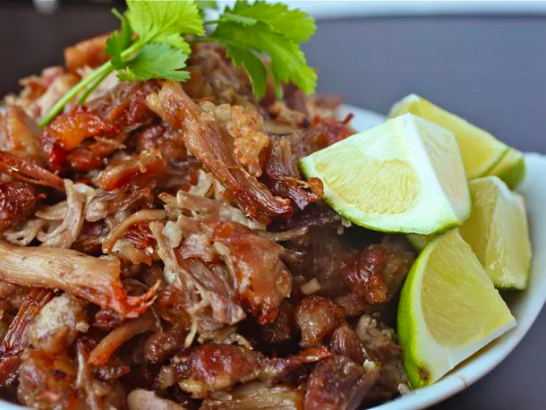

# Carnitas

- Total time: 4 hours
    - Prep time: 15 minutes
    - Cook time: 3½ hours
    - Post-cook time: 15 minutes
- Yield: ~3 lbs
- Author: [J. Kenji López-Alt](https://www.seriouseats.com/no-waste-tacos-de-carnitas-with-salsa-verde-recipe)

{:width="600px"}
 
_Image source: <https://seriouseats.com>_

## Inventory

### Ingredients

- 3 pounds pork shoulder
- Salt
- 1 medium orange
- ½ onion
- 4 cloves garlic
- 2 bay leaves
- ¼ cup vegetable oil

### Special Equipment

- 9x13 baking dish
- Large strainer
- Medium bowl

## Instructions

_Optionally cut the 3 lbs pork shoulder into 2 inch cubes and dry brine overnight_

### Prepare

1. Preheat oven to 275°F
1. Slice into 2 inch cubes
    - **3 lbs pork shoulder**
    - Season with **Salt**
1. Slice into 4 quarters
    - **1 orange**
1. Slice in half
    - **½ onion**
1. In 9x13 baking dish
    1. Arrange around dish
        - **Cubed pork shoulder**
    1. Squeeze juice over pork
        - **4 orange quarters**
    1. Wedge into the dish in an even layer:
        - **4 squeezed orange rind quarters**
        - **Halved ½ onion**
        - **4 cloves garlic**
        - **2 bay leaves**
    1. Pour over dish
        - **¼ cup vegetable oil**

### Cook

1. Cover dish tightly in foil
1. ~3½ hours at 275°F - cook in oven until firm tender

### Postpare

1. Discard everything but **pork and juices**
1. 10 min - strain **pork and juices** in medium-sized bowl
1. Add **pork** back to the dish (or container for storing)
    - _Optionally skim fat off top of juices and add fat back to dish_
1. Using two forks or your fingers, shred **pork**

## Notes

### Serving

1. Preheat broiler to high with oven rack 4 inches below heating element
1. ~6 minutes - broil pork until brown and crisp on surface
1. ~6 more minutes - stir, broil again until crisp

Serve on tortilla with onions + cilantro, avocado, tomatillo salsa, cotija cheese.

### Storage

- Will keep in airtight container in refridgerator for like a week
