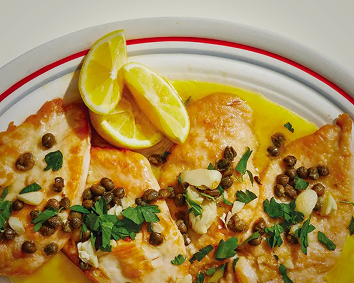

# Chicken Piccata

- Total time: 35 minutes
    - Prep time: 15 minutes
    - Cook time: 20 minutes
- Yield: 4 servings
- Modified from: [Chris Morocco](https://www.bonappetit.com/recipe/chicken-piccata-2)

{:width="600px"}
 
_Image source: <https://example.com>_

## Inventory

### Ingredients

- 2 **large skinless, boneless chicken breasts**
- **Kosher salt**
- ½ cup **all-purpose flour**
- 3 T **extra-virgin olive oil**, divided
- 4 cloves **garlic**
- ⅓ cup **dry white wine**
- 3 T **drained capers**
- ½ cup **chicken stock**
- 4 T **unsalted butter**
- 3 T **lemon juice**
- **Parsely**, for serving
- **Lemon wedges**, for serving

### Special Equipment

- Plastic wrap
- Small bowl
- Plate
- 2 plates
- Large skillet

## Instructions

### Prepare

1. Peel and smash
    - **4 cloves garlic**
1. Coarsely chop
    - **3 T drained capers**
1. Cut into pieces
    - **4 T unsalted butter**
1. Flatten chicken
    1. Slice in half crosswise
        - **2 large skinless, boneless chicken breasts**
    1. Lightly pound each piece between sheets of plastic wrap until even thickness (about ½" thick or less)
    1. Season lightly with **kosher salt**
1. In small bowl
    1. Add
        - **½ cup all-purpose flour**
    1. Working one at a time
        1. Add cutlet to bowl
        1. Toss to coat
        1. Knock off extra flour
        1. Transfer to plate

### Cook

1. In large skillet over med-high
    1. Heat
        - **3 T extra-virgin olive oil**
    1. 2 min - unmoving, until deeply browned
        - **Sliced and breaded chicken breasts**
    1. 30 sec - turn over
    1. Transfer to clean plate
    1. 2 min - until golden brown
        - **1 T extra-virgin olive oil**
        - **4 cloves garlic, smashed**
    1. 3 min - swirling and scraping, until almost evaporated
        - **⅓ cup dry white wine**
        - **3 T drained capers**
    1. 1 min - swirl vigorously
        - **½ cup chicken stock**
        - **4 T unsalted butter**
    1. 2 min - simmer until sauce can coat a spoon
        - **Cooked chicken breasts**
    1. Remove from heat
    1. Add
        - **3 T lemon juice**
        - **Kosher salt**

### Post-cook

1. Transfer chicken and sauce to a platter
1. Top with **parsely**
1. Serve with **lemon wedges**

## Notes

### Storage

- Will keep in airtight container at room temperature or in the refridgerator for about a week
