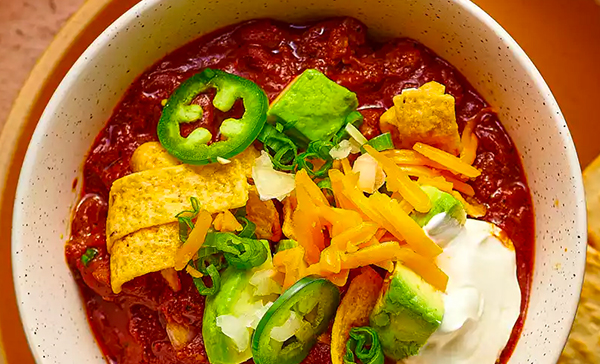

# Chili

- Total time: 90 minutes
    - Prep time: 45 minutes
    - Cook time: 45 minutes
    - Post-cook time: 5 minutes
- Yield: 4 servings
- Modified from: [Alex Bilski](https://www.youtube.com/watch?v=YgSPaXgAdzE), [J. Kenji López-Alt](https://www.seriouseats.com/the-best-chili-recipe), [Daniel Gritzer](https://www.seriouseats.com/pressure-cooker-ground-beef-and-bean-chili), [Amy + Jacky](https://www.pressurecookrecipes.com/instant-pot-chili/)

{:width="600px"}
 
_Image source: <https://seriouseats.com>_

## Inventory

### Ingredients

#### Chili base

- Vegetable oil
- Kosher salt
- 2 pounds ground beef
- 1 medium yellow onion
- ½ jalapeño
- 4 cloves garlic
- 1 anchovy fillet
- 1 28oz can whole peeled tomatoes
- 1 T tomato paste
- 1 dried bay leaf
- 1 T brown sugar

#### Umami stock mixture

- 1 cup unsalted chicken stock
- 2 T fish sauce
- 1 T soy sauce

#### Spices

- 2 T chili powder
- 1 T ground cumin
- 2 tsp dried oregano
- 1 tsp ground coriander
- ½ tsp smoked paprika
- 1 tsp unsweetened cocoa powder
- 1 tsp coffee grounds
- Freshly ground black pepper

### Special Equipment

- 1 tiny bowl
- 1 small bowl
- 3 medium bowls
- Large skillet
- Large skillet lid

## Instructions

### Prepare

1. Finely dice
    - **1 medium yellow onion**
    - **½ jalapeño**
1. Mince **4 cloves garlic**
1. Mash into paste, alternating cutting and mashing with side of knife
    - **1 anchovy fillet**
    - Pinch of salt
1. In medium bowl, crush by hand
    1. **1 28oz can whole peeled tomatoes**
1. In small bowl
    - **1 cup unsalted chicken stock**
    - **2 T fish sauce**
    - **1 T soy sauce**
1. In tiny bowl
    - **2 T chili powder**
    - **1 T ground cumin**
    - **2 tsp dried oregano**
    - **1 tsp ground coriander**
    - **½ tsp smoked paprika**
    - **1 tsp unsweetened cocoa powder**
    - **1 tsp coffee grounds**

### Cook

1. In skillet over high
    1. Cook until browned
        1. **2 pounds ground beef**
        1. Season with **almost too much salt**
    1. Remove **beef** and set aside
    1. Pour **fat drippings** into plastic container, adding some back to pan as needed
1. Reduce heat to medium-high
    1. 5-6 min
        - **1 diced medium yellow onion**
    1. 1 min
        - **4 minced cloves garlic**
    1. 1 min - until darkened
        - **1 T tomato paste**
1. Reduce heat to medium
    1. 1 min - mix and cook
        - **Anchovy paste**
        - **Diced jalapeño**
    1. 30 sec - mix and cook (will be very dry)
        - **Spice mixture**
    1. Deglaze with some of chicken stock mixture
    1. Mix (will be very full)
        - **Rest of chicken stock mixture**
        - **Crushed tomatoes**
        - **Browned beef**
        - **1 dried bay leaf**
1. Crank heat to high until simmering
1. Reduce heat to low
1. At least 30 min - simmer, lid on, checking and stirring every 10 min
    - If too thick, add water
    - If too thin, simmer until desired consistency
1. Cook for as long as you want

### Post-cook

1. Discard **bay leaf**
1. Add **1 T brown sugar**
1. Season with **salt**, **freshly ground black pepper**, and **any other spices** to taste

## Notes

Garnish with any of:

- Green onion
- Grated cheese
- Sour cream
- Jalapeños or poblanos
- Avocado
- Fritos

### Storage

- Will keep in airtight container in the refridgerator for about 5 days
