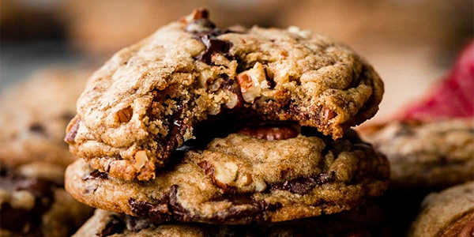

# Chocolate Chip Cookies (Brown Butter Pecan)

- Total time: 2 hours 50 minutes to 3 days
    - Prep time: 30 minutes
    - Chill time: 2 hours to 3 days
    - Cook time: 12 minutes
    - Post-cook time: 5 minutes
- Yield: 36 cookies
- Modified from: [Sally's Baking Addiction](https://sallysbakingaddiction.com)

{:width="600px"}
 
_Image source: <https://sallysbakingaddiction.com>_

## Inventory

### Ingredients

- 1 cup (130g) **pecans**
- 8oz (226g) semi-sweet or bittersweet **chocolate bars**
- 1 cup (2 sticks; 226g) **unsalted butter**
- 2½ cups (313g) **all-purpose flour**
- 1 tsp **baking soda**
- ¾ tsp **ground cinnamon**
- ⅛ tsp any other **warm spice** _(optional)_
- ½ tsp **kosher salt**
- 1⅛ cup (225g) packed light or dark **brown sugar**
- ⅜ cup (75g) **granulated sugar**
- 2 large **eggs**
- 2¼ tsp **vanilla extract**

### Special Equipment

- Small saucepan
- Cutting board
- Knife
- 1 small bowl
- 1 medium bowl
- 1 large bowl

## Instructions

### Prepare

_Preheat oven to 300°F_

#### Brown Butter

1. In small saucepan
    1. Brown **1 cup (16 T; 226g) unsalted butter**
    1. In small bowl
        1. 5 min _(10 min max)_ - let rest

#### Toast Pecans

1. On parchment-lined baking sheet
    - **1 cup (130g) pecans**
1. 5-7 min - toast at 350°F
1. 5+ min - let cool

#### Prepare Dough

1. Rough chop **8oz (226g) semi-sweet or bittersweet chocolate bars**
1. Rough chop **cooled toasted pecans**
1. Finely chop ~1 T toasted pecans into **pecan dust**
1. In large bowl
    1. Mix
        - **2½ cups (313g) all-purpose flour**
        - **1 tsp baking soda**
        - **¾ tsp ground cinnamon**
        - **⅛ tsp any other warm spice _(optional)_**
        - **½ tsp salt**
1. In medium bowl
    1. Mix
        - **Browned butter**
        - **1⅛ cup (225g) packed light or dark brown sugar**
        - **⅜ cup (75g) granulated sugar**
    1. Mix
        - **2 large eggs**
        - **2¼ tsp vanilla extract**
1. In dry ingredient bowl
    1. Mix **wet ingredients** into **dry ingredients**
    1. Mix
        - **Rough chopped chocolate**
        - **Rough chopped toasted pecans**
        - **Finely chopped pecan dust**

### Chill

1. 2 hours to 3 days - cover and refrigerate

### Pre-bake

1. Preheat oven to 350°F
1. Pull dough into **35g chunks**
1. Arrange on parchment-lined baking sheet 3" apart

### Bake

1. 12-15 min - bake at 350°F
    - Until edges appear set

### Post-bake

1. 5 min - cool on baking sheet
1. Transfer to wire rack to cool

## Notes

### Storage

- Will keep in airtight container at room temperature or in the refridgerator for about a week
- Dough will keep in freezer for up to 3 months
