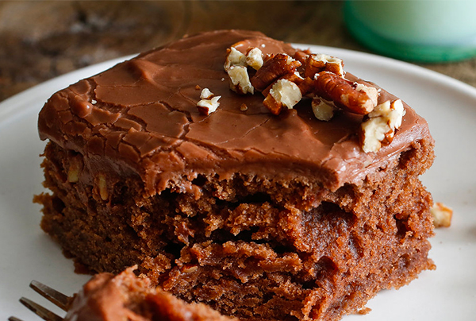

# Chocolate Sheath Cake

- Total time: 90 minutes
    - Prep time: 30 minutes
    - Cook time: 30 minutes
    - Post-cook time: 30 minutes
- Yield: 1 9x13 cake
- Modified from: Grammy

{:width="600px"}
 
_Image source: <https://nytimes.com>_

## Inventory

### Ingredients

#### Cake

- 4 T (32g) **unsweetened cocoa powder**
- ½ tsp **espresso powder or coffee grounds**
- 8 T (1 stick; ½ cup) **margarine** (~80% fat)
- ½ cup **shortening**
- 1 cup **water**
- 2 cups (400g) **granulated sugar**
- 2 cups (250g) **all-purpose flour**
- 1 tsp **ground cinnamon**
- 1 tsp **baking soda**
- ½ tsp **kosher salt**
- 1½ tsp **vanilla extract**
- 2 **large eggs**, room temperature
- ½ cup **buttermilk**

_To grease cake pan_

- Bit of **shortening** or **margarine**
- Pinch of **all-purpose flour**

#### Icing

- 6 T (¾ stick; ⅜ cup) **margarine** (~80% fat)
- 5 T **milk**
- 4 T (32g) **unsweetened cocoa powder**
- ⅛ tsp **kosher salt**
- 4 cups (480g) **powdered sugar**
- 1½ tsp **vanilla extract**
- 1 cup (130g) **pecans**

### Special Equipment

- Baking sheet
- Foil
- Knife
- Small bowl
- Small saucepan
- Medium bowl
- Electric mixer
- 9x13 cake pan

## Instructions

### Prepare

#### Toast pecans

1. Preheat oven to 350°F
1. On baking sheet
    1. Line with foil
    1. Spread
        - **1 cup pecans**
    1. 7-10 min - bake until fragrant
    1. 5-10 min - let cool
    1. Roughly chop **toasted pecans** into small bowl

#### Prepare batter

1. Preheat oven to 350°F
1. In small saucepan
    1. Bring to boil then take off heat
        - **4 T unsweetened cocoa powder**
        - **½ tsp espresso powder or coffee grounds**
        - **8 T margarine**
        - **½ cup shortening**
        - **1 cup water**
1. In medium bowl
    1. Whisk
        - **2 cups (400g) granulated sugar**
        - **2 cups (250g) all-purpose flour**
        - **1 tsp ground cinnamon**
        - **1 tsp baking soda**
        - **½ tsp kosher salt**
    1. Mix
        - **Chocolate mixture**
    1. Mix
        - **1½ tsp vanilla extract**
        - **2 eggs**
    1. Mix
        - **½ cup buttermilk**
1. In 9x13 cake pan
    1. **Grease** and **all-purpose flour**
    1. Pour in **batter**

### Bake

1. 20-30 min - bake at 350°F until toothpick exits almost dry

#### Prepare icing

1. While cake is baking, in small saucepan
    1. Bring to boil then take off heat
        - **6 T (¾ stick; ⅜ cup) margarine**
        - **5 T milk**
        - **4 T unsweetened cocoa powder**
        - **⅛ tsp kosher salt**
    1. Sift & mix a little at a time
        - **4 cups (480g) powdered sugar**
    1. Mix
        - **1½ tsp vanilla extract**
    1. Mix
        - **1 cup chopped pecans**

### Post-bake

1. Immediately after removing cake from oven, pour icing over cake
1. Let cool completely before covering

## Notes

### Storage

- Will keep in airtight container at room temperature or in the refridgerator for about a week
