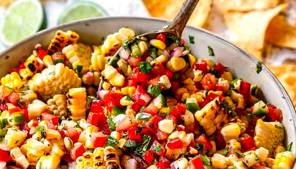

# Corn Salsa

- Total time: 25 minutes
    - Prep time: 15 minutes
    - Cook time: 10 minutes
- Yield: About 5 servings, 3 cups
- Modified from: [Carlsbad Cravings](https://carlsbadcravings.com/corn-salsa/)

{:width="600px"}
 
_Image source: <https://example.com>_

## Inventory

### Ingredients

- 16oz can of sweet corn
- 1 roma tomato
- 1 jalepeño
- ½ red bell pepper
- ¼ red onion
- ⅛ cup cilantro
- 1 T lime juice
- ½ T apple cider vinegar
- ½ tsp ground cumin
- ½ tsp salt
- ¼ tsp garlic powder
- ¼ tsp smoked paprika
- ¼ tsp black pepper

### Special Equipment

- Cast iron skillet
- Large bowl

## Instructions

### Prepare

1. Rinse and drain **16oz can of sweet corn**
1. In cast iron skillet over high heat
    1. Add olive oil
    1. 5-7 min - cook until charred, stirring once or twice
    1. Set aside to cool
1. Dice
    - **1 roma tomato**
    - **1 jalepeño**
    - **½ red bell pepper**
    - **¼ red onion**
1. Mince
    - **⅛ cup cilantro**
1. In large bowl
    1. Mix
        - ½ diced red bell pepper
        - 1 diced roma tomato
        - ¼ diced red onion
        - 1 diced jalepeño
        - ⅛ cup minced cilantro
        - **1 T lime juice**
        - **½ T apple cider vinegar**
        - **½ tsp ground cumin**
        - **½ tsp salt**
        - **¼ tsp garlic powder**
        - **¼ tsp smoked paprika**
        - **¼ tsp black pepper**
    1. Mix in charred corn once cooled
1. Season with additional lime juice and/or salt and pepper to taste

## Notes

- Best after letting rest 30-60 min

### Storage

- Will keep in airtight container at room temperature or in the refridgerator for about 4-5 days
