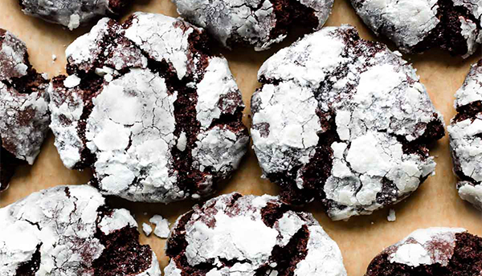

# Double Chocolate Crinkle Cookies

- Total time: 3 hours 45 minutes
    - Prep time: 20 minutes
    - Chill time: 3 hours
    - Cook time: 12 minutes
    - Post-cook time: 10 minutes
- Yield: 20-22 cookies
- Modified from: [Sally's Baking Addiction](https://sallysbakingaddiction.com/double-chocolate-crinkle-cookies/)

{:width="600px"}
 
_Image source: <https://sallysbakingaddiction.com>_

## Inventory

### Ingredients

- 1 cup (125g) **all-purpose flour**
- ½ cup + 2 T (50g) **unsweetened cocoa powder**
- 1 tsp **baking soda**
- ⅛ tsp **kosher salt**
- ½ cup (1 stick; 115g) **unsalted butter**, room temperature
- ½ cup (100g) **granulated sugar**
- ½ cup (100g) packed light or dark **brown sugar**
- 1 large **egg**, room temperature
- 1 tsp **vanilla extract**
- 1 cup (180g) mini or regular size **semi-sweet chocolate chips**
- 3 T (35g) **granulated sugar**, for rolling
- 1 cup (120g) **confectioners’ sugar**, for rolling

### Special Equipment

- 2 medium bowls
- Baking scale
- Hand mixer / stand mixer w/ paddle
- Baking sheet
- Parchment paper

## Instructions

### Prepare

1. In medium bowl
    - **1 cup (125g) all-purpose flour**
    - **½ cup + 2 T (50g) unsweetened cocoa powder**
    - **1 tsp baking soda**
    - **⅛ tsp kosher salt**
1. In medium bowl
    1. 2-3 min - beat on med-high until fluffy and light in color
        - **½ cup (1 stick; 115g) unsalted butter, room temperature**
        - **½ cup (100g) granulated sugar**
        - **½ cup (100g) packed light or dark brown sugar**
    1. Beat on high
        - **1 large egg, room temperature**
        - **1 tsp vanilla extract**
1. On low
    1. Add **dries** to **wets**
    1. Dough will be very sticky
1. Hand mix
    - **1 cup (180g) mini or regular size semi-sweet chocolate chips**

### Chill

1. 3 hours to 3 days - cover and refrigerate

### Pre-bake

1. 10 min - rest **cookie dough** at room temperature
    - _If dough chilled longer than 3 hours, let rest at room temperature for at least 20 min_
1. Preheat oven to 350°F
1. Line baking sheet with parchment paper
1. In small bowl
    - **3 T (35g) granulated sugar**
1. In small bowl
    - **1 cup (120g) confectioners’ sugar**
1. Scoop dough into 1½ T (35g) balls
    1. Roll lightly in **granulated sugar**
    1. Roll generously in **confectioners’ sugar**
1. Arrange on baking sheet 3" apart

### Bake

1. 11-12 min - bake at 350°F
    - Until edges appear set
    - Centers look soft
    - _If they haven't spread 9 min in, remove from the oven and lightly bang baking sheet on counter 2-3 times_

### Post-bake

1. 5 min - cool on baking sheet
1. Transfer to wire rack to cool

## Notes

### Storage

- Will keep in airtight container at room temperature or in the refridgerator for about a week
