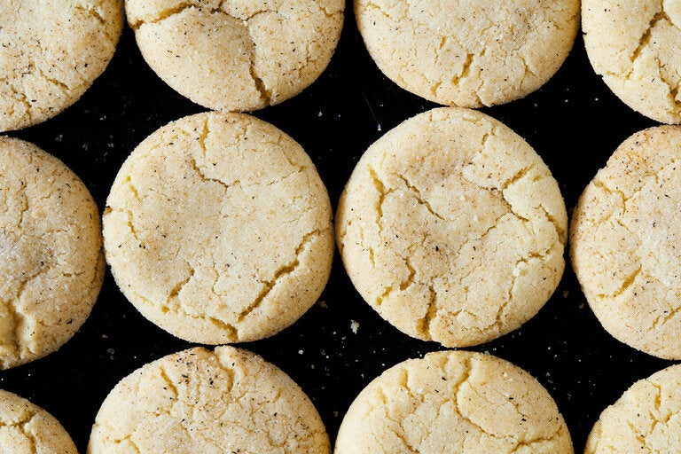

# Eggnog Snickerdoodles

- Total time: 70 minutes
    - Prep time: 20 minutes
    - Rest time: 30 minutes
    - Cook time: 15 minutes
    - Post-cook time: 5 minutes
- Yield: 24 cookies
- Modified from: [Vaughn Vreeland](https://cooking.nytimes.com/recipes/1021715-eggnog-snickerdoodles)

{:width="600px"}
 
_Image source: <https://nytimes.com>_

## Inventory

### Ingredients

#### Dough

- 3½ cups (445g) **all-purpose flour**
- 2 tsp **cream of tartar**
- 1 tsp **baking soda**
- 2 tsp **ground nutmeg**
- 1 cup (226g; 2 sticks) **unsalted butter,** room temperature
- 1¾ cup (350g) **granulated sugar**
- 1 tsp **kosher salt**
- 1 large **egg** plus 3 **egg yolks**, room temperature
- 2 tsp **rum extract**
- 1 tsp **vanilla extract**

#### Topping

- ¼ cup (50g) **granulated sugar**
- 2 T **ground nutmeg**

### Special Equipment

- 1 medium bowl
- 1 large bowl
- Hand mixer / stand mixer w/ paddle

## Instructions

### Prepare

1. In medium bowl
    1. Mix
        - **3½ cups (445g) all-purpose flour**
        - **2 tsp cream of tartar**
        - **1 tsp baking soda**
        - **2 tsp ground nutmeg**
1. In large bowl
    1. Mix, medium-high, 3-4 min till fluffly
        - **1 cup (226g; 2 sticks) unsalted butter**
        - **1¾ cup (350g) granulated sugar**
        - **1 tsp kosher salt**
    1. Mix, medium, one at a time
        - **1 large egg plus 3 egg yolks**
    1. Mix
        - **2 tsp rum extract**
        - **1 tsp vanilla extract**
1. Mix
    - **Dries** into **wets**
        - May be a bit crumbly at first, will combine as the dough hydrates

### Rest

1. At least 30 min to hydrate dough

### Pre-bake

1. Preheat oven to 350°F
1. Roll dough into **45g balls**
1. In small bowl
   - **¼ cup (50g) granulated sugar**
   - **2 T ground nutmeg**
1. Roll dough balls in **sugar mixture**
1. Arrange on parchment-lined baking sheet 3" apart

### Bake

1. 9-12 min - bake at 350°F
    - Until edges appear set

### Post-bake

1. 3-5 min - cool on baking sheet
    - _Optional_
        - Press with spoon while warm
        - Top with more nutmeg
1. Transfer to wire rack to cool

## Notes

### Storage

- Will keep in airtight container at room temperature or in the refridgerator for about a week
