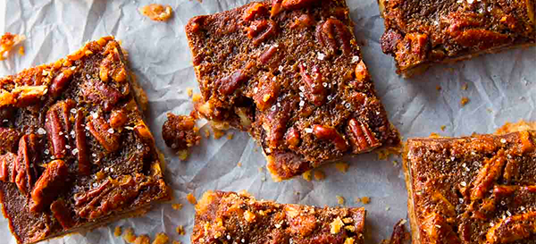

# Pecan Pie Bars

- Total time: 2 hours 10 minutes
    - Prep time: 30 minutes
    - Cook time: 40 minutes
    - Post-cook time: 1 hour
- Yield: 8x8 pan
- Modified from: [Sally's Baking Addiction](https://sallysbakingaddiction.com/brown-butter-pecan-pie-bars/)

{:width="600px"}
 
_Image source: <https://sallysbakingaddiction.com>_

## Inventory

### Ingredients

#### Crust

- ½ cup (115g; 1 stick) **unsalted butter**
- ¼ cup (50g) **granulated sugar**
- ½ tsp **vanilla extract**
- ¼ tsp **kosher salt**
- 1 cups (125g) **all-purpose flour**

#### Topping

- ½ cup (115g) **unsalted butter**
- ½ cup (100g) packed light or dark **brown sugar** (preferably dark)
- ½ cup (120ml) **maple syrup**
- 2 T **heavy cream**
- 2 large **eggs**
- 3 cups (300g) **pecans**, coarsely chopped

### Special Equipment

- Baking scale
- Small bowl or 2-cup measuring cup
- Medium bowl
- Medium saucepan
- Baking sheet
- Parchment paper

## Instructions

### Prepare crust

1. Preheat oven to 350°F
1. Prepare 8x8 pan with **non-stick spray** and/or parchment paper

1. Brown **½ cup (115g; 1 stick) unsalted butter**
    1. 5 min - cool
1. In medium bowl
    - **Browned butter**
    - **¼ cup (50g) granulated sugar**
    - **½ tsp vanilla extract**
    - **¼ tsp kosher salt**
    - **1 cups (125g) all-purpose flour**
1. Press **crust dough** into 8x8 pan
    - **Dough** should be slightly crumbly and hold its shape

### Bake crust

1. 15 min - bake at 350°F
    - Meanwhile, prepare topping

### Prepare topping

1. In medium bowl
    1. Coarsely chop
        - **3 cups (300g) pecans**
1. In small bowl or 2-cup measuring cup
    1. Whisk **2 eggs** until homogenous
1. In medium saucepan
    1. Melt
        - **½ cup (115g) unsalted butter**
        - **½ cup (100g) packed light or dark brown sugar**
        - **½ cup (120ml) maple syrup**
        - **2 T heavy cream**
    1. 3 min - boil
        1. 2 min in - temper **eggs** with **½ cup of boiling butter/sugar mixture**
    1. Remove from heat
    1. Slowly stream into saucepan
        - **Tempered eggs**
    1. Add
        - **3 cups (300g) pecans, coarsely chopped**
1. Pour **topping** evenly over **baked crust**

### Bake

1. 25-30 min - bake at 350°F
    - Toothpick should come out pretty clean

### Post-bake

1. Optionally sprinkle **flaky salt** on top
1. Cool completely in pan on wire rack

## Notes

### Storage

- Will keep in airtight container at room temperature or in the refridgerator for about a week
