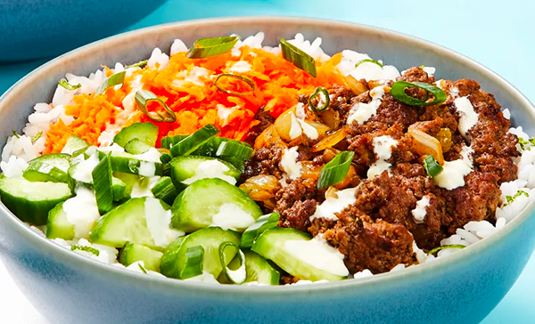

# Ponzu Beef Bowl

- Total time: 30 minutes
    - Prep time: 15 minutes
    - Cook time: 10 minutes
    - Post-cook time: 5 minutes
- Yield: 4 servings
- Modified from: [EveryPlate](https://www.everyplate.com/recipes/sweet-ponzu-beef-bowls-5e46ac769b2eb6549c0156e7)

{:width="600px"}
 
_Image source: <https://everyplate.com>_

## Inventory

### Ingredients

- Cooked white rice, for serving
- 2 cloves garlic
- 1 lime
- 1 yellow onion
- 1 bunch scallions
- 1 small cucumber
- ½ tsp granulated sugar
- Kosher salt
- 2 T mayonnaise
- Wasabi or sriracha
- Freshly ground black pepper
- Neutral oil
- 1½ lb ground beef
- 4 tsp granulated sugar
- 2 T ponzu sauce
- 1 T unsalted butter
- 3 oz matchstick carrots

### Special Equipment

- Medium bowl
- Small bowl
- Large skillet

## Instructions

### Prepare

_Cook white rice before prepping ingredients._

1. Peel, mince
    - **2 cloves garlic**
1. Zest, quarter
    - **1 lime**
1. Dice
    - **1 yellow onion**
1. Thinly slice, separating whites from greens
    - **1 bunch scallions**
1. Thinly slice into half-moons
    - **1 small cucumber**
1. In medium bowl
    1. Add
        - **Sliced cucumber**
        - **Juice from half the lime**
        - **½ tsp granulated sugar**
        - **Pinch of kosher salt**
    1. Set aside to quick-pickle, stirring occasionally
1. In small bowl
    - **2 T mayonnaise**
    - **Pinch of garlic**
    - **Squeeze of lime juice**
    - **Wasabi or sriracha**
    - **Kosher salt**
    - **Freshly ground black pepper**

### Cook

1. In large skillet over medium-high
    1. 4-5 min - until softened
        - **Neutral oil**
        - **1 diced yellow onion**
        - **1 bunch scallion whites**
    1. 4-5 min - until almost cooked through
        - **1½ lb ground beef**
        - **Remaining garlic**
        - **4 tsp granulated sugar**
    1. Remove from heat
    1. Add
        - **2 T ponzu sauce**
        - **Kosher salt**
        - **Freshly ground black pepper**
1. To rice
    1. Fluff with fork
    1. Add
        - **1 T unsalted butter**
        - **Lime zest**
        - **Kosher salt**

### Post-cook

1. Add to bowl
    1. **Lime rice**
    1. **Cooked beef**
    1. **3 oz matchstick carrots, pickled cucumber**
    1. **1 bunch scallion greens**
    1. **Lime juice**
    1. **Wasabi mayo**

## Notes

### Storage

- Will keep in airtight container at room temperature or in the refridgerator for about a week
