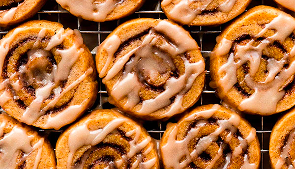

# Pumpkin Spice Roll Cookies

- Total time: 3 hours 10 minutes
    - Prep time: 45 minutes
    - Chill time: 2 hours
    - Cook time: 15 minutes
    - Post-cook time: 10 minutes
- Yield: 48 cookies
- Author: [Sarah Kieffer](https://sallysbakingaddiction.com/pumpkin-spice-roll-cookies/)

{:width="600px"}
 
_Image source: <https://sallysbakingaddiction.com>_

## Inventory

### Ingredients

#### Cookies

- 2¼ cups (281g) **all-purpose flour**
- 2 tsp **pumpkin pie spice**[[x](https://sallysbakingaddiction.com/pumpkin-pie-spice/)]
- ½ tsp **ground cinnamon**
- ½ tsp **baking powder**
- ¼ tsp **kosher salt**
- ¾ cup (1½ stick; 170g) **unsalted butter**, room temperature
- ¾ cup (150g) **granulated sugar**
- 6 T (86g) **pumpkin puree**
- 1½ tsp **vanilla extract**

#### Filling

- 3 T (43g) **unsalted butter**, melted, slightly cooled
- ⅔ cup (135g) packed light or dark **brown sugar**
- 2 tsp **pumpkin pie spice**[[x](https://sallysbakingaddiction.com/pumpkin-pie-spice/)]
- 1 tsp **ground cinnamon**

#### Maple Icing

- 2 T (30g) **unsalted butter**
- ⅓ cup (80ml) pure **maple syrup**
- 1 cup (112g) **confectioners' sugar**
- Pinch of **kosher salt**

### Special Equipment

- Baking scale
- Medium bowl
- Large bowl
- Hand mixer / stand mixer w/ paddle
- Rolling pin
- Pastry brush
- Small saucepan
- Baking sheet
- Parchment paper

## Instructions

### Prepare

1. Blot **6 T (86g) pumpkin puree** with a clean towel or paper towels.
    - You should be left with **⅓ cup (75g) puree** for the recipe.

#### Cookie dough

1. In medium bowl
    - **2¼ cups (281g) all-purpose flour**
    - **2 tsp pumpkin pie spice**
    - **½ tsp ground cinnamon**
    - **½ tsp baking powder**
    - **¼ tsp kosher salt**
1. In large bowl
    1. 2 min - beat on high
        - **¾ cup (1½ stick; 170g) unsalted butter**
        - **¾ cup (150g) granulated sugar**
    1. 1 min - beat on high
        - **⅓ cup (75g) blotted pumpkin puree**
        - **1½ tsp vanilla extract**
1. Add **dry ingredients** to **wet ingredients**
    1. Beat on low

#### Roll up

1. In small bowl
    - **⅔ cup (135g) packed light or dark brown sugar**
    - **2 tsp pumpkin pie spice**
    - **1 tsp ground cinnamon**
1. On floured work surface
    1. Divide **dough** in half
    1. Pat each into small rectangle
    1. Roll out each into 10x8" rectangle ¼" thick
1. Spread
    1. **Half of 3 T (43g) unsalted butter** on each
1. Sprinkle
    1. **Half of brown sugar / spice mixture** on each
    1. Pat down with back of a spoon
1. Slowly, tightly roll up each into a 10" log

#### Chill

1. 2 hours to 3 days - cover and refridgerate
    1. Every 15 min for first hour, rotate 90 degrees

#### Slice

_Preheat oven to 350°F_

1. Remove logs from refridgerator
1. Slice into 24 ⅓" cookies
    1. Slice in half (2 sections)
    1. Slice each in half (4 sections)
    1. Slice each in half (8 sections)
    1. Slice each in thirds (24 sections)
1. Mold cookies from ovals back into circles if necessary

### Bake

1. Line baking sheet with parchment paper
1. Arrange cookies about 2" apart
1. 13-15 min - bake at 350°F
    - Until lightly browned around the bottom

### Post-bake

1. ~10 min - cool completely on pan

#### Icing

1. In small bowl
    1. Sift
        - **1 cup (112g) confectioners' sugar**
1. In small saucepan
    1. Melt over low
        - **2 T (30g) unsalted butter**
        - **⅓ cup (80ml) pure maple syrup**
    1. Remove from heat
    1. Whisk
        - Sifted confectioners' sugar
    1. Add pinch of kosher salt

1. Drizzle over cookies
    - Will set after about 1 hour

## Notes

### Storage

- Will keep in airtight container at room temperature for 2-3 days
