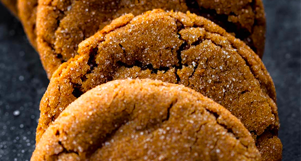

# Soft Ginger Molasses Cookies

- Total time: 2 hours
    - Prep time: 30 minutes
    - Chill time: 60 minutes
    - Cook time: 12 minutes
    - Post-cook time: 10 minutes
- Yield: 30-32 cookies
- Modified from: [Sarah Kieffer](https://sallysbakingaddiction.com/soft-molasses-cookies/)

{:width="600px"}
 
_Image source: <https://sallysbakingaddiction.com>_

## Inventory

### Ingredients

- 2¼ cups (280g) all-purpose flour
- 1½ tsp baking soda
- 2 tsp ground ginger
- 1½ tsp ground cinnamon
- ¼ tsp ground cloves
- ¼ tsp nutmeg
- ¼ tsp salt
- ¾ cup (170g) unsalted butter, room temperature
- ½ cup (100g) packed light or dark brown sugar
- ¼ cup (50g) granulated sugar
- ⅓ cup (80ml) unsulphured or dark molasses
- 1 large egg, room temperature
- 2 tsp pure vanilla extract
- ⅓ cup (65g) granulated or coarse sugar, for rolling

### Special Equipment

- 1 small bowl
- 1 medium bowl
- Baking scale
- Hand mixer
- Baking sheet
- Parchment paper

## Instructions

### Prepare

1. In small bowl
    - **2¼ cups (280g) all-purpose flour**
    - **1½ tsp baking soda**
    - **2 tsp ground ginger**
    - **1½ tsp ground cinnamon**
    - **¼ tsp ground cloves**
    - **¼ tsp nutmeg**
    - **¼ tsp salt**
1. In medium bowl
    1. Beat on high until creamy
        - **¾ cup (170g) unsalted butter, room temperature**
        - **½ cup (100g) packed light or dark brown sugar**
        - **¼ cup (50g) granulated sugar**
    1. Beat on low
        - **⅓ cup (80ml) unsulphured or dark molasses**
    1. Beat on low
        - **1 large egg, room temperature**
        - **2 tsp pure vanilla extract**
1. On low
    1. Add **dries** to **wets**

### Chill

1. 1 hour to 3 days - cover and refridgerate

### Pre-bake

1. Preheat oven to 350°F
1. Line baking sheet with parchment paper
1. Remove **cookie dough** from refridgerator
    1. _If dough chilled longer than 2 hours, let rest at room temperature for at least 30 min_
1. In small bowl
    - **⅓ cup (65g) granulated or coarse sugar**
1. Scoop dough into 1 T balls
    1. Roll in **sugar**
1. Arrange on baking sheet 3" apart

### Bake

1. 11-12 min - bake at 350°F
    - Until edges appear set

### Post-bake

1. 5 min - cool on baking sheet
1. Transfer to wire rack to cool

## Notes

### Storage

- Will keep in airtight container at room temperature or in the refridgerator for about a week
