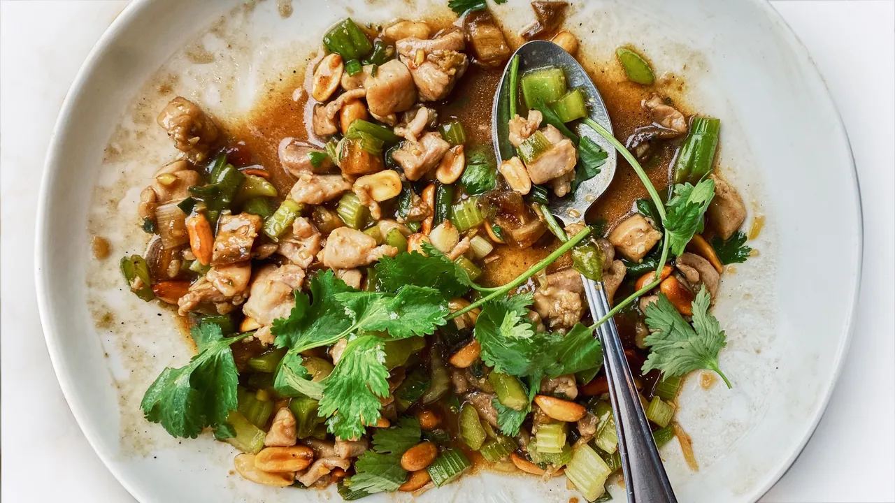

# Spicy Chicken Stir-Fry With Celery and Peanuts

- Total time: 50 min
    - Prep time: 20 min
    - Cook time: 25 min
    - Post-cook time: 5 min
- Yield: 4 servings
- Author: [Molly Baz](https://www.bonappetit.com/recipe/spicy-chicken-stir-fry-with-celery-and-peanuts)

{:width="600px"}
 
_Image source: <https://bonappetit.com>_

## Inventory

### Ingredients

- 2 tsp, ¼ cup soy sauce, divided
- 1½ tsp, 1 tsp tsp cornstarch, divided
- ½ tsp, 1 tsp sugar, divided
- ½ tsp kosher salt, plus more to taste
- 1 lb skinless, boneless chicken thighs
- 3 T sambal oelek
- 2 T rice vinegar
- ¼ cup water
- 4 garlic cloves
- 2" piece ginger
- 6 scallions
- 4 celery stalks
- 4 oz medjool dates (about 5)
- 1½ cups cilantro leaves with tender stems, divided
- ⅓ cup vegetable oil
- ¾ cup roasted, salted peanuts
- Cooked rice (for serving)

#### Ingredient Substitutes

- Chicken
    - 1 lb pork loin
    - 10-15 oz shiitake mushrooms
- Rice vinegar
    - Mirin (remove sugar)
- Scallions
    - Green onions
- Medjool dates
    - Other dates
    - Raisins, prunes probably
- Peanuts
    - Cashews

### Special Equipment

- 2 medium bowls
- 2 small bowls
- Whisk
- Slotted spoon
- Cast-iron skillet

## Instructions

### Prepare

_Cook rice or sides before prepping._

1. In medium bowl
    1. Whisk
        - **2 tsp soy sauce**
        - **1½ tsp cornstarch**
        - **½ tsp sugar**
        - **½ tsp salt**
    1. Cut into ½" pieces, add to bowl with marinade
        - **1 lb skinless, boneless chicken thighs**
1. Whisk in small bowl
    - **3 T sambal oelek**
    - **2 T rice vinegar**
    - **¼ cup soy sauce**
    - **1 tsp cornstarch**
    - **1 tsp sugar**
    - **¼ cup water**
1. Combine in small bowl
    - **4 garlic cloves** - finely chop
    - **2" piece ginger** - finely chop (with skins, doesn't matter)
1. Combine in medium bowl
    1. **6 scallions** - trim roots, slice crosswise into ½" pieces
    1. **4 celery stalks** - cut in half lengthwise, then crosswise into ½" pieces
    1. **4 oz dates** - remove and discard pits, cut into ½" pieces
1. Coarsely chop
    - **1½ cup cilantro leaves**
        - 1 cup - for stir fry
        - ½ cup - reserve for serving

### Cook

**Fry nuts**

1. In cast-iron skillet over medium
    1. Combine
        - **⅓ cup vegetable oil**
        - **¾ cup roasted, salted peanuts**
    1. 5-7 minutes - cook, stirring often, until a few shades darker and fragrent
    1. Remove from heat with slotted spoon, transfer to small bowl or plate

**Stir fry**

1. In cast-iron skillet over medium-high
    1. Add **oil**
    1. 30 sec - cook **garlic/ginger combo**, stirring constantly until fragrant but not yet browned
    1. 3 min - add **½" pieces chicken**, stir until no longer pink on outsides (will be undercooked)
    1. 2 min - add **scallions, celery, dates**, stirring often, until scallions are bright green and slightly softened
       - Celery should be quite crisp and crunchy
    1. 2 min - add **reserved sauce** (stir first to reincorporate cornstarch) until sauce thickens and turns glossy

### Postpare

1. Remove skillet from heat
1. Stir in **fried peanuts, chopped cilantro**
1. Add **salt** to taste
1. Scatter **celery leaves, cilantro leaves** when serving

## Notes

### Storage

- Will keep in airtight container in refridgerator for like 4-5 days probably
