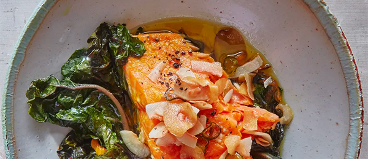

# Turmeric Salmon with Coconut Crisp

- Total time: 45 minutes
    - Prep time: 10 minutes
    - Cook time: 30 minutes
    - Post-cook time: 5 minutes
- Yield: 4 servings
- Modified from: [Andy Baraghani](https://www.bonappetit.com/recipe/turmeric-salmon-with-coconut-crisp)

{:width="600px"}
 
_Image source: <https://bonappetit.com>_

## Inventory

### Ingredients

#### Greens

- 3 T extra-virgin olive oil
- 2 bunches swiss chard
- 1 large shallot
- 1 3" piece ginger
- Kosher salt

#### Fish

- 2 T extra-virgin olive oil
- ½ tsp ground turmeric
- 24oz skinless salmon fillet, preferably center cut
- Freshly ground black pepper

#### Coconut crisp

- 1 T extra-virgin olive oil
- 3 cloves garlic
- ½ serrano chile
- ½ cup unsweetened coconut flakes

#### Rice or sides

- Rice or sides

### Special Equipment

- 4 small bowls
- Cast iron skillet
- Small skillet

## Instructions

### Prepare

_Prepare rice or sides if desired_

1. Preheat oven to 300°F
1. Remove ribs and stems from **2 bunches swiss chard**
    1. In small bowl
        1. Finely chop
            - **ribs and stems**
        1. Thinly slice
            - **1 3" piece ginger**
            - **1 large shallot**
    1. In separate small bowl
        1. Coarsely chop **leaves**
1. In small bowl
    1. Thinly slice
        - **3 cloves garlic**
        - **½ serrano chile**
    1. Add
        - **½ cup unsweetened coconut flakes**
1. In small bowl
    - **2 T extra-virgin olive oil**
    - **½ tsp ground turmeric**

### Cook greens

1. In cast iron skillet over medium-high
    1. 3 min - cook until shallot is softened but not browned
        - **Swiss chard/ginger/shallot mixture**
    1. 3 min - cook until leaves partly wilted
        - **Chopped swiss chard leaves**
    1. Remove from heat
    1. Season with **salt**
    1. Add **24oz skinless salmon fillet** on top of **greens**
        - Season with **salt**
        - Coat with **turmeric/oil mixutre**

### Bake salmon

1. 25-30 min at 300°F until
    - Fillet is just opaque in center
    - Fillet flakes easily
    - Grens are tender

### Cook cocunut crisp

1. In small skillet over medium
    1. 5 min - cook, stirring often until garlic and coconut turn golden
        - **1 T extra-virgin olive oil**
        - **Garlic/chile/coconut flakes mixture**
    1. Transfer to small bowl and season lightly with **salt**

### Post-bake/cook

1. Season **salmon** with **freshly ground black pepper**
1. 5 min - let rest
1. Top with **coconut crisp**

## Notes

### Storage

- I have no idea how long the coconut crisp will last
- The fish won't last long
